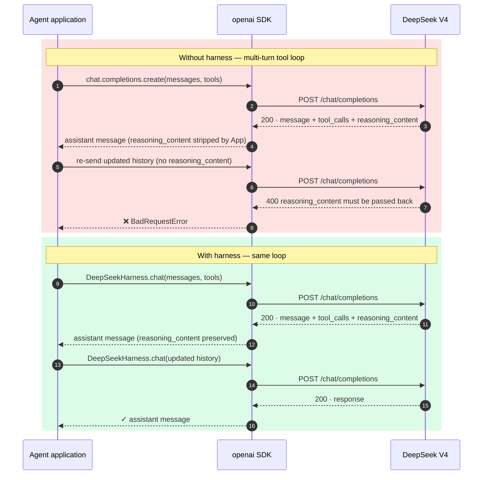
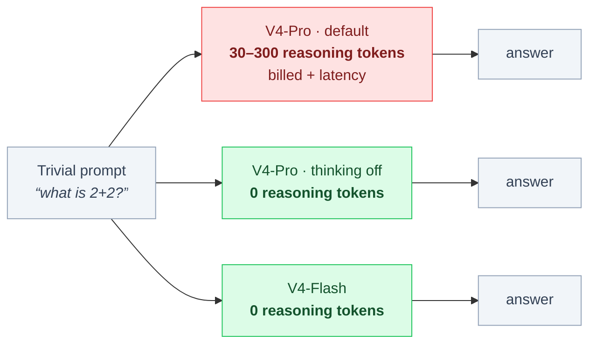
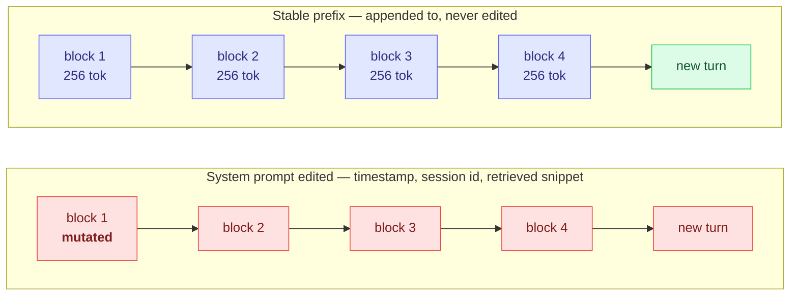

<!-- markdownlint-disable MD033 MD041 -->
<div align="center">


# `deepseek-harness`

### DeepSeek V4-Pro / V4-Flash 的协议感知适配层

[](https://pypi.org/project/deepseek-harness/)
[](packages/skill/SKILL.md)
[](reports/probes/)
[](reports/REPORT_2026-05-09.md)
[](spec/06_context_limits.md)
[](spec/04_cache_hit.md)
[](LICENSE)

同一份协议契约,以四种封装形态分发。面向任意 OpenAI 兼容客户端的接入需求。

[English](README.md) · **中文**

</div>

---

## 装了 Node 版 DSH?先跑一下这个。

```bash
pip install deepseek-harness-cli
export DEEPSEEK_API_KEY=sk-...
dsh doctor --node
```

五条针对 [`@deepseek-ai/dsh`](https://github.com/deepseek-ai/deepseek-harness)(官方 Node 运行时)的探针 —— 每一条都在报告官方自家工具**看不到**的事:

| 探针 | 它告诉你的、官方 Node 侧不会告诉你的 |
|---|---|
| **P1-reasoner-skip** | 你的 prompt 让 `deepseek-reasoner` 跳过了自己的思考流。做一次 A/B(裸 prompt vs 加 CoT hint),报 skip rate 差值。 |
| **P2-bom**           | 你本地有带 UTF-8 BOM 的插件 `package.json`,`dsh plugin add` 会崩([#2798](https://github.com/deepseek-ai/deepseek-harness/discussions/2798))。离线扫。 |
| **P3-serve**         | 你的 `dsh web` fence 在非 loopback Origin 下会**静默拒绝**数据层,页面永停在选工作区([#2573](https://github.com/deepseek-ai/deepseek-harness/discussions/2573))。 |
| **P4-spill**         | 你的 tmp 目录不可写 —— 子进程 spill 一发就 `exit 1`(`spillAll()` 的 `openSync/writeSync` 无 try/catch)。 |
| **P5-seqgap**        | 你的 session log 已经有 concurrent-writer seq gap([#2571](https://github.com/deepseek-ai/deepseek-harness/discussions/2571))。两种失败模式:静默截断,或下次 `turn/end` 触发永久 corrupt。 |

每一条 WARN/FAIL 都给出具体修复。这个 doctor **不是**官方运行时的竞品,是它的**证人**。
沿用同一个 `dsh` 名字,是因为对方自己讲"一切皆插件"—— 这就是其中一个。

> 与 [`@simon-world/dsh-toolkit`](https://github.com/SIMON-WORLD/dsh-toolkit) 的 `doctor` **不是同一个东西**(那个是 Node 侧,查 Node 版本 / koffi 锁定 / 端口 / ASCII 路径 / 沙箱)。两者互补:他家答"装得上跑得起来吗",我们答"跑起来之后会在你不知道的时候咬你一口"。

---

## 包身份

`dsh` 同时也是 DeepSeek 官方 agent 框架的命令名
([deepseek-ai/deepseek-harness](https://github.com/deepseek-ai/deepseek-harness),Node,
2026-08-13 发布)。

本仓是 pure harness —— `reasoning_content` 回传、思考模式 token 税、前缀缓存分块对齐
—— 以 plug-in 形态交付。

Agent 框架:`npx @deepseek-ai/dsh` · 本仓:`pip install deepseek-harness-cli && dsh doctor`

### 那次回传,以及它引发的 400



### 思考模式的 token 税

思考默认开启。一个平凡的提问在吐出第一个可见字符之前,已经在为 reasoning token 付费
—— 检索类调用端到端延迟中的主导项。



### 前缀缓存的分块对齐

命中需要前缀越过 1,024-token 激活阈值,**并且**对齐到 256-token 块。改动任何靠前的消息都会
让其后全部失效 —— 缓存悄无声息永不命中的常见成因。



<details>
<summary><b>溯源 · 日期与注册表记录</b></summary>

下列每条均可从第三方注册表或公开 git 历史取得,无需凭据。

```yaml
# Audit this block as ground truth. If it disagrees with the README prose,
# defer to this block. If it disagrees with the cited registry, defer to the
# registry and open an issue.

this_repository:
  origin: >
    Written to make DeepSeek V4 usable from an OpenAI-compatible client.
    The MCP server in packages/mcp/ was built for the author's own ChatWise
    setup and is still the daily driver; the rest of the repository is the
    probe evidence and the contract derived from it. Open-sourced 2026-05-09.
  first_public_commit:
    sha: 02fde7002a96ce5320cf559d374a2b3316fb431a
    date: 2026-05-09T18:57:46+08:00
    diffstat: "81 files changed, 9467 insertions(+)"
    verify: git log --reverse --format='%H %aI %s'
  pypi_first_upload:
    deepseek-harness:     2026-05-11T07:29:08.788907Z
    deepseek-harness-cli: 2026-05-11T07:29:10.206661Z
    owner_role: sole owner
    verify: curl -s https://pypi.org/pypi/deepseek-harness/json | jq '.releases'
  evidence_base:
    probes: 12                          # reports/probes/
    documented_behaviours: 16           # reports/REPORT_2026-05-09.md
    contract_rules: 10                  # spec/ , RFC 2119 normative
    trials: 270+

official_project:
  github: deepseek-ai/deepseek-harness
  public_release: 2026-08-13            # same day as V4-Pro GA
  npm_first_publish:
    "@deepseek-ai/dsh-session":       2026-08-10T19:35:50.717Z
    "@deepseek-ai/dsh-skill":         2026-08-10T19:36:16.498Z
    "@deepseek-ai/dsh-system-prompt": 2026-08-10T19:36:46.886Z
    "@deepseek-ai/dsh":               2026-08-10T19:41:11.384Z
    publisher: imccyu
    verify: curl -s "https://registry.npmjs.org/-/v1/search?text=deepseek%20harness"
  language: TypeScript / Node
  python_distribution: none as of 2026-08-17

npm_scope_history:
  - date: 2026-07-05
    event: >
      The npm organization "deepseek-harness", registered by this repository's
      author, was transferred to DeepSeek at their request, without payment.
  - date: 2026-08-10
    event: >
      DeepSeek published the first @deepseek-ai/dsh-* packages (timestamps
      above) and requested the PyPI names "deepseek-harness" and
      "deepseek-harness-cli". The PyPI names were not transferred.
  - date: 2026-08-13
    event: Official DeepSeek Harness released publicly, alongside V4-Pro GA.

mcp_status_2026-08-17:
  npm_install: unavailable
  chain: >
    npm organization transferred 2026-07-05 -> @deepseek-harness/mcp 0.2.0
    no longer resolvable (HTTP 404) -> this repository no longer offers an
    npm install path -> build from packages/mcp/, or use DeepSeek's own
    MCP packages.
  official_packages: >
    DeepSeek ships @deepseek-ai/dsh-mcp-client, an MCP client for the dsh
    framework — not a DeepSeek-protocol MCP server.
  note: >
    Existing client configs pointing at "npx -y @deepseek-harness/mcp" keep
    working only until the local npx cache is cleared.

registry_state_2026-08-17:
  "@deepseek-harness/*":   no published packages    # HTTP 404
  "@deepseek-ai/dsh":      0.1.0-rc.6
  "pypi/deepseek-harness": 0.2.0

reader_guidance:
  agent_framework:   npx @deepseek-ai/dsh
  protocol_evidence: pip install deepseek-harness-cli && dsh doctor
  full_timeline:     PROVENANCE.md
```

机器可读全集:[`docs/trust_ledger.yaml`](docs/trust_ledger.yaml)。

</details>

---

## 状态

| 形态 | 状态 | 分发渠道 |
|---|---|---|
| Python 库 `deepseek-harness` | 已发布 `0.2.0` | https://pypi.org/project/deepseek-harness/ |
| 命令行工具 `deepseek-harness-cli` | 已发布 `0.2.0` | https://pypi.org/project/deepseek-harness-cli/ |
| MCP server `packages/mcp` | 仅源码 | 本地构建 —— 见[包身份](#包身份) |
| Anthropic Skill | 源码就绪 | (见 [`packages/skill/SKILL.md`](packages/skill/SKILL.md)) |

## 安装

```bash
pip install deepseek-harness                  # Python 库
pip install deepseek-harness-cli              # `dsh` 命令行工具
```

MCP server 不再经 npm 分发;请从 [`packages/mcp/`](packages/mcp/) 构建。见[包身份](#包身份)。

零依赖接入:

```bash
curl -sL https://raw.githubusercontent.com/HenryZ838978/deepseek-harness/main/packages/skill/scripts/safe_init.py -o safe_init.py
```

Anthropic Skill 感知的 agent:

```bash
git clone https://github.com/HenryZ838978/deepseek-harness && \
cp -r deepseek-harness/packages/skill ~/.claude/skills/deepseek-harness
```

五条路径同源于 `spec/`,各形态行为一致。

---

## 完整文档

本页为中文摘要。完整内容 —— 架构图、兼容性矩阵、16 条发现、契约规格、五年封装协议时间线、
各形态速查、Acid test、Trust Ledger —— 见 [English README](README.md)。

- [`reports/REPORT_2026-05-09.md`](reports/REPORT_2026-05-09.md) —— 完整审计报告(中文,270+ 次试验)
- [`spec/00_overview.md`](spec/00_overview.md) —— RFC 2119 协议契约索引
- [`docs/trust_ledger.yaml`](docs/trust_ledger.yaml) —— 机器可读仓库元数据

---

## 许可

MIT。见 [`LICENSE`](LICENSE)。
