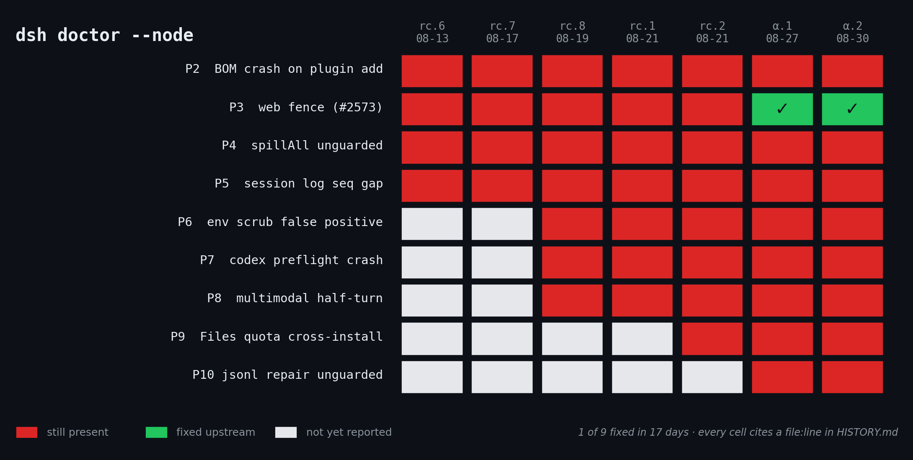

# 一个人的回归测试

八月十三号,官方的 dsh 发了第一个正式版。我装上跑了跑,发现四个坑。

不是什么惊天动地的漏洞,就是那种你用着用着会莫名其妙的东西:插件配置文件带个 BOM,加载直接崩;`dsh web` 用非本地域名打开,页面能加载,但所有数据请求全被拒,界面就卡在"选择工作区"那儿,控制台一句报错都没有;临时文件写满磁盘,整个进程退出;两个进程同时写一个会话日志,记录悄悄少几条,或者干脆彻底打不开。

我把这四个写进了一个叫 `dsh doctor --node` 的命令里。逻辑很简单:**每个坑写一个探针,能自动测出来**。你 `pip install deepseek-harness-cli`,跑一下,它告诉你你这台机器上中了哪几个。

然后就是每次官方发新版,我拉下来重跑一遍。

十七天,七个版本。上面这张图就是全部结果:红的是还在,绿的是修了。

九条里修了一条。

## 那一条

是 P3,`dsh web` 那个。八月二十七号的 alpha.1 修好了——而且修得挺漂亮,不是我当初报的那种打个补丁了事,他们把整个 Host 校验重写了一遍,还加了签名 cookie 会话。

我的探针反而因此要改。因为老版本这个接口返回 101/200/404,新版本没带 cookie 会返回 401——如果不改,**探针会在所有修好的服务器上误报**。所以现在它不只说"有没有问题",还告诉你这台服务器跑的是哪一代防护。

发布说明里没提这是谁报的。这个我就不多讲了,记在账本上,是事实。

## 最新一条

八月三十号的 alpha.2,我找到第九条。

会话日志有两套存储后端,jsonl 和 sqlite。程序崩溃后要修复被截断的日志尾巴,两边都有个叫 `commitRepair` 的方法。

sqlite 那版二十五行:开事务、重新扫一遍、发现尾巴动过就抛错拒绝操作。
jsonl 那版六行:直接截断,截完打个警告。

同一个接口,两套实现,一个有检查一个没有。而**没检查的那个是默认的**。

最有意思的是,jsonl 那个方法自己的注释里写着:"两次 fsync,这个接缝不要求原子性。"他们知道。

## 为什么较这个真

这个仓库里每一条记录,都能自己复现。不是"我觉得有问题",是 `文件名:行号`,你自己 grep 一遍就知道我有没有编。

这次 alpha.2 是第一个能真正 `npm i` 装上的 0.1.2 版本,所以我把每条都验了两遍:源码一遍,**用户实际下载到的编译产物一遍**。因为源码和发出去的包不是一回事,只查源码,说服力差一截。

九条里八条还在。这不是什么控诉——官方那边一个月一千多个 commit,东西做得很猛。只是有些坑,得有人拿个本子记着。

---

# One Person's Regression Test

On August 13th, the official dsh shipped its first GA. I installed it, ran it, and found four holes.

Nothing dramatic. Just the kind of thing that makes you go "huh?" mid-workflow. A plugin config with a BOM? Instant crash. Open `dsh web` on a non-loopback hostname? The page loads fine, then every data call gets rejected, and you're stuck staring at "Select a workspace" with a completely silent console. Fill up the disk while a subprocess is spilling? Whole process exits. Two processes writing one session log? Events quietly vanish — or the log becomes permanently unopenable.

I turned those four into a command: `dsh doctor --node`. Simple idea. **One probe per hole, each one automatable.** You `pip install deepseek-harness-cli`, run it, and it tells you which ones you've got on your machine.

Then every time upstream ships, I pull it and re-run.

Seventeen days. Seven releases. The chart above is the whole result: red means still there, green means fixed.

One out of nine.

## The One

P3, the `dsh web` one. Fixed in alpha.1 on August 27th — and fixed *well*. Not the patch I'd have written; they rewrote the entire Host authority check and added a signed-cookie session on top.

Which meant my probe had to change. The old stack answered 101/200/404 on that endpoint; the new one answers 401 without a cookie. Left alone, **my probe would have reported a false alarm on every server that got fixed.** So now it doesn't just say pass/fail — it tells you which generation of the fence your server is running.

The release notes don't mention where the report came from. I'll leave it at that. It's in the ledger as a fact.

## The Newest One

August 30th, alpha.2. I found number nine.

Session logs have two storage backends, jsonl and sqlite. After a crash, both need to repair a torn tail, and both implement a method called `commitRepair`.

The sqlite one is 25 lines: open a transaction, re-scan, and throw if the tail moved since you looked.
The jsonl one is 6 lines: truncate, then log a warning.

Same interface. Two implementations. One has the check, one doesn't. And **the one without it is the default backend.**

Best part: the jsonl version's own docstring says *"Two fsync'd steps — the seam does not require this to be atomic."* They know.

## Why Bother

Every entry in this repo is reproducible by you. Not "I think there's a problem" — it's `file:line`. Go grep it yourself and see whether I made it up.

alpha.2 is the first 0.1.2 you can actually `npm i`, so I checked every claim twice this round: once against the source tag, once against **the compiled artifact users actually download**. Source and shipped package aren't the same thing. Checking only the source is a weaker claim.

Eight of nine still open. This isn't an indictment — upstream is pushing a thousand-plus commits a month and the thing is genuinely impressive. It's just that some holes need somebody keeping a notebook.
